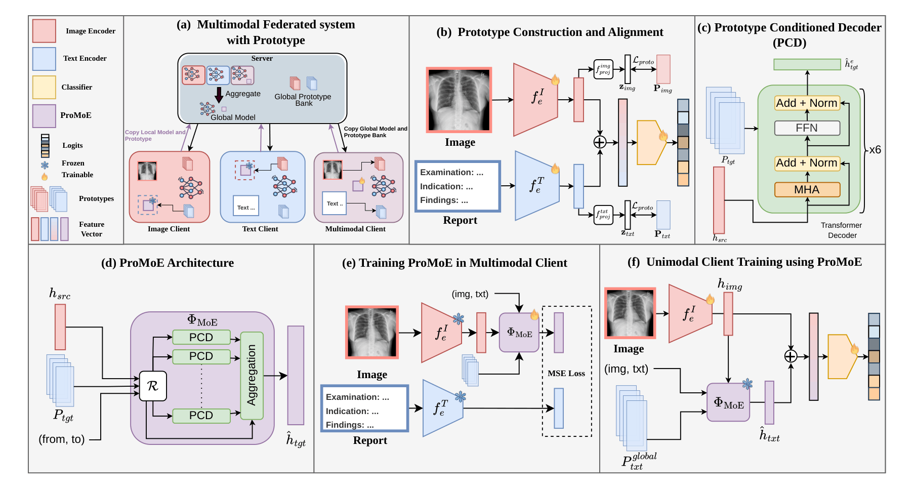

# ProMoE-FL: Prototype-conditioned Mixture of Experts for Multimodal Federated Learning with Missing Modalities
 

**Authors:** Aavash Chhetri, Bibek Niroula, Eduard Vazquez, Yash Raj Shrestha, Prashnna Gyawali, Loris Bazzani, Binod Bhattarai

**Note: This repository will be updated in the next few days with the implementation and code for ProMoE-FL. Please stay tuned!**

This repository contains the official implementation of our **MICCAI 2026** paper **ProMoE-FL: Prototype-conditioned Mixture of Experts for Multimodal Federated Learning with Missing Modalities**.

Overview of the **ProMoE-FL**. **(a)** Multimodal federated learning system with different types of client. **(b)** Prototype construction and alignment via learnable modality-specific prototypes. **(c)** Architecture of the Prototype-Conditioned Decoder (PCD). **(d)** ProMoE architecture integrating multiple PCD experts. **(e)** Training of ProMoE on multimodal clients using available image-text feature pairs. **(f)** Unimodal client training, where missing modality features are synthesized using the ProMoE component.

---

## Datasets

The framework was trained and evaluated using four public chest X-ray datasets:

* [MIMIC-CXR-JPG](https://physionet.org/content/mimic-cxr-jpg/2.1.0/)

* [NIH Open-I](https://www.kaggle.com/datasets/nih-chest-xrays/data)

* [PadChest](https://arxiv.org/pdf/1901.07441)

* [CheXpert](https://www.kaggle.com/datasets/ashery/chexpert)

## Acknowledgments

1. This work was supported as part of the "Swiss AI initiative" by a grant from the Swiss National Supercomputing Centre (CSCS) under project ID a168 on Alps.
2. We would like to thank for the code from [CreamFL](https://github.com/FLAIR-THU/CreamFL) and [CARMFL](https://github.com/bhattarailab/CAR-MFL) repository.